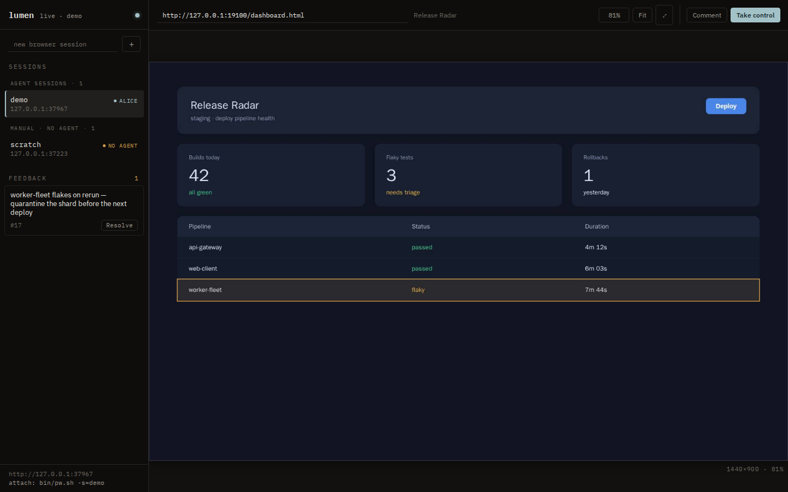
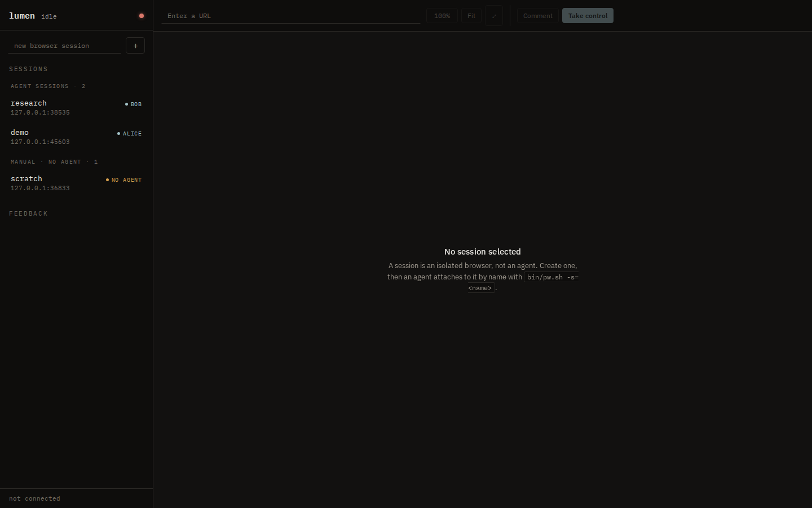
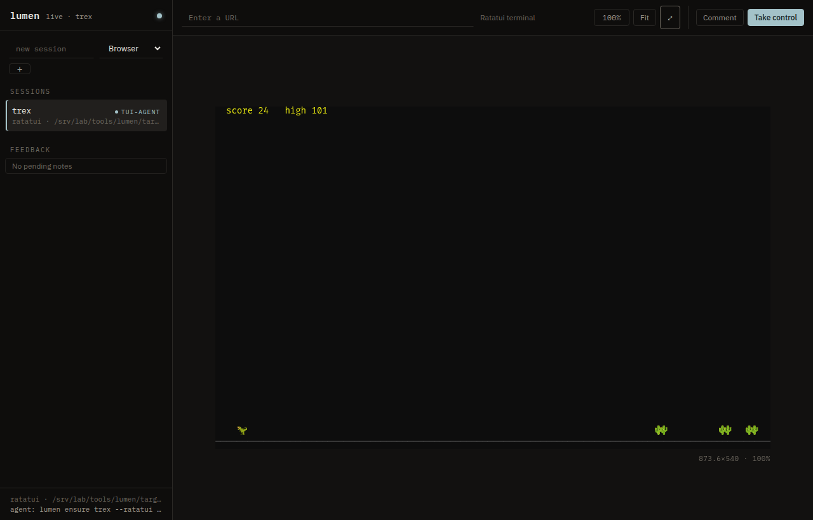
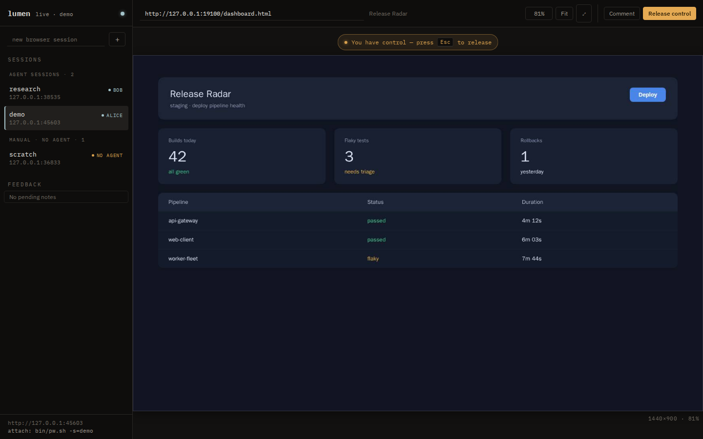
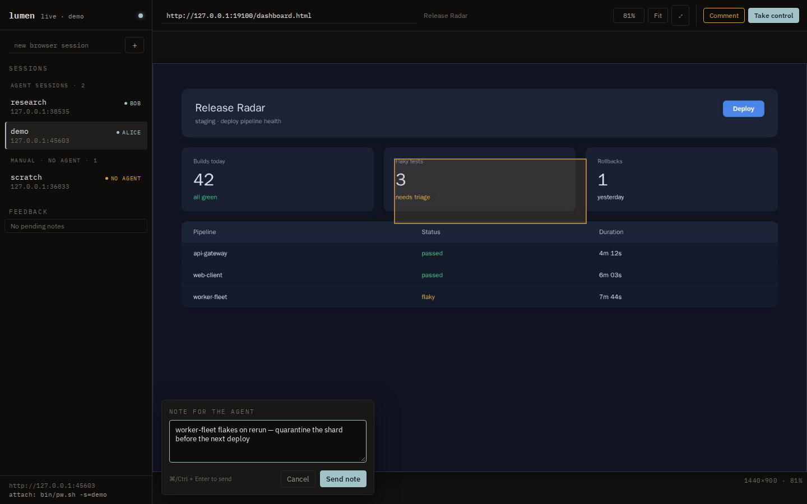

# Lumen

<p align="center">
  
</p>

<p align="center">
  
</p>

One service that gives every agent its own isolated Chromium, Quickshell desktop,
or ratatui terminal surface and gives the human a live, controllable view of the
same session. Agents drive real pages over a capability API or CDP, render
terminals as text, and desktop surfaces natively; the human watches the active
tab, desktop, or grid, can take over input at any moment, and leaves annotated
feedback the agent reads back.

## How it fits together

- **Control plane** — an HTTP/JSON API (`/v1/...`) for sessions, browser
  navigation, tabs, viewport, screenshots, terminal text, and raw CDP.
- **View plane** — browser sessions use CDP screencasting; Quickshell sessions use
  native Wayland screencopy; ratatui sessions stream styled cells from the app's
  own buffer diff. All three are rendered to the same viewer canvas, and zoom is
  view-only.
- **Feedback** — humans drag a rectangle, type a note; it lands in SQLite and
  the agent picks it up with one command. No watcher, no polling surface files.

## Install

You need Linux with Podman or Docker (including compose support) and `make`.
Node.js 20+ is only required to run the browser test-suite and the host agent
CLI, Rust only to hack on the service itself — the image build handles the rest.

```bash
git clone http://vigilance:3002/blackopsrepl/lumen.git
cd lumen
make bootstrap
```

`make bootstrap` installs the host agent CLI, builds the container image,
starts the service, installs the systemd user unit and the opencode skill, and
finishes with a black-box smoke test. When it prints *Bootstrap complete*, open:

**http://localhost:8899**

<p align="center">
  
</p>

To run on a different port or with different runtime binaries:

```bash
cp .env.example .env       # set LUMEN_PORT, LUMEN_CHROME, or desktop binaries
make restart
```

Docker permission: on distros where your user cannot reach the system daemon
(the socket is `root:docker` and you are in no `docker` group), Lumen runs
`docker` via passwordless `sudo` automatically. Alternatives: join the group
(`sudo usermod -aG docker $USER`, then log out/in), set `LUMEN_DOCKER_SUDO=1`
to allow a sudo password prompt, or point `DOCKER_HOST` at a daemon you own
(e.g. rootless).

## Drive a browser as an agent

```bash
bin/pw.sh -s=alice goto https://example.com
bin/pw.sh -s=alice snapshot              # accessibility tree with element refs
bin/pw.sh -s=alice click e12
bin/pw.sh -s=alice fill e7 "hello"
bin/pw.sh -s=alice screenshot
bin/ctr.sh exec lumen lumen feedback alice --consume   # selected runtime; read + ack human notes
```

`bin/pw.sh` asks Lumen to ensure the session's browser, attaches
`playwright-cli` over CDP, and runs your command. Sessions started this way are
marked **agent-owned** in the viewer, so the human knows someone is reading the
feedback. `make install-skill` gives opencode agents the full playbook.

## Run a Quickshell surface

Quickshell sessions run one headless Sway compositor and one Quickshell process
per session. The path must be an absolute path to `shell.qml` or its containing
directory, and it must be readable by the Lumen process:

```bash
lumen ensure dashboard --quickshell /var/lib/lumen/projects/dashboard/shell.qml --owner dashboard-agent
```

When Lumen runs in the production container, configure
`LUMEN_QUICKSHELL_ROOT` to a host directory containing the QML path. Compose
mounts that directory read-only at the same absolute path inside the container,
so imports and sibling assets continue to resolve without path translation:

```bash
sudo install -d -o "$USER" -g "$(id -gn)" /var/lib/lumen/projects
LUMEN_QUICKSHELL_ROOT=/var/lib/lumen/projects
lumen ensure dashboard --quickshell /var/lib/lumen/projects/dashboard/shell.qml
```

The default root is the FHS application-data path `/var/lib/lumen/projects`;
override it in `.env` when the host keeps QML projects elsewhere.

The viewer can also create a Quickshell session with the session-type selector.
Desktop sessions support native screenshots, mouse, wheel, and text input. They
do not have browser tabs, navigation, page scale, or CDP endpoints. The
`sway_bin`, `quickshell_bin`, and `wtype_bin` settings, or the corresponding
`LUMEN_SWAY`, `LUMEN_QUICKSHELL`, and `LUMEN_WTYPE` environment variables, select
the runtime binaries.

The runtime image includes Chromium, Sway, Quickshell, wtype, grim, tmux, and
the Qt dependencies required by desktop and terminal sessions. tmux is included
because terminal sessions run real TUI programs, and common session managers
such as trex require it. The Quickshell package comes from
the Avenge Media Dank Linux PPA and is installed from the Ubuntu 25.10 package
repositories because Quickshell requires Qt 6.6 or newer. Host deployments may
still override the binary paths through configuration or environment variables.

## Run a ratatui terminal

A ratatui session runs an app that links the `lumen-ratatui` crate. The path must
be an absolute path to the app binary, and the binary must be executable:

```bash
cargo build --release -p lumen-ratatui --example trex
lumen ensure trex --ratatui "$PWD/target/release/examples/trex" --owner tui-agent
lumen ensure trex --ratatui /path/to/target/release/examples/trex --owner tui-agent
```

There is no PTY and no terminal emulator. The app builds a normal ratatui
`Terminal` on a `LumenBackend`, and ratatui's own buffer diff — only the cells
that changed — is the transport. Lumen mirrors those cells into an authoritative
grid and streams it to the viewer, so the viewer paints cells, not pixels.

Because the grid is structured, an agent reads a session's screen as text with no
screenshot and no vision:

```bash
curl http://127.0.0.1:8899/v1/sessions/trex/screen
```

The app owns rendering and the service owns the grid. A viewer that connects
late, or falls behind, receives the next full snapshot and is consistent again.
Initial geometry comes from `tui_cols` and `tui_rows` (or `LUMEN_TUI_COLS` and
`LUMEN_TUI_ROWS`); the viewer scales the grid to fit. Terminal sessions support
keys, text, mouse, and wheel in cell coordinates, and `POST
/v1/sessions/{name}/screenshot` is refused in favour of `/screen`.

The viewer can also create a ratatui session with the session-type selector. To
run the demo under Lumen, point it at the built `trex` example; the app exits
immediately when it is not launched by the service.

<p align="center">
  
</p>

The service also exposes the same capabilities over plain HTTP:

| Capability | Endpoint |
| --- | --- |
| sessions | `GET/POST /v1/sessions`, `GET/DELETE /v1/sessions/{name}` |
| navigate | `POST /v1/sessions/{name}/navigate` |
| tabs | `GET/POST /v1/sessions/{name}/tabs`, `POST …/{index}/activate`, `DELETE …/{index}` |
| viewport / page scale | `PUT/DELETE /v1/sessions/{name}/viewport`, `PUT …/page-scale` |
| screenshot | `POST /v1/sessions/{name}/screenshot?full=true` |
| terminal screen | `GET /v1/sessions/{name}/screen` (ratatui, plain text) |
| raw CDP | `POST /v1/sessions/{name}/cdp` |
| stream + input | `GET /v1/sessions/{name}/stream` (WebSocket) |
| feedback | `GET/POST /v1/sessions/{name}/feedback`, `GET …/feedback/{id}/screenshot`, `POST …/ack-all` |
| audit trail | `GET /v1/audit` |

## Watch and steer as a human

Every session is listed on the left of the viewer. The canvas is a live view of
the browser's active tab or the Quickshell output at its native viewport size. Use
**Take control** to forward your mouse, wheel, and typing into the page;
**Escape** hands control back to the agent. While you do not hold control,
scroll zooms and dragging pans the frame at any zoom, like a document reader —
handy for inspecting details without sending input to the page.
Tabs the browser opens on its own — a `target=_blank` link, a popup — are
adopted automatically, so what you watch is always the tab the browser is
actually showing.

<p align="center">
  
</p>

To leave feedback, click **Comment** and drag a rectangle over the area. Lumen
captures those pixels as a PNG the moment you send the note, so it still shows
what you meant after the page navigates or reflows. The agent reads the note on
its next `lumen feedback` call, which saves the screenshot under
`$LUMEN_FEEDBACK_DIR` (default `<temp>/lumen-feedback`) and can also fetch it
from `…/feedback/{id}/screenshot`.

<p align="center">
  
</p>

Because the container shares the host network, pages can reach dev servers on
the host at `http://127.0.0.1:<port>` (`host.containers.internal` and
`host.docker.internal` also resolve to loopback).

## Operate

| make target | what it does |
| --- | --- |
| `make up` | rebuild and start; recreates the container when it predates this checkout |
| `make down` / `make restart` | stop / hard restart (session state is ephemeral) |
| `make status` | container state, health, active sessions |
| `make logs` | follow service logs |
| `make shell` | shell inside the container |
| `make build` | rebuild the image |
| `make version` | show version and ports |
| `make help` | every target, grouped |

Configuration lives in `config/lumen.toml`; `LUMEN_CONFIG`, `LUMEN_PORT`,
`LUMEN_CHROME`, `LUMEN_SWAY`, `LUMEN_QUICKSHELL`, and `LUMEN_WTYPE` override it,
and `LUMEN_LOG` sets the service's log level (see
`.env.example`). A globally exported `RUST_LOG` is deliberately ignored so a
shell setting cannot silently change the container's verbosity. The systemd
user unit (`make install-systemd`) keeps the service running across logouts via
linger.

Session profiles are ephemeral. Lumen gives each browser or desktop instance a
private profile directory under `<data_dir>/run` and reclaims it when that
session ends — on session delete, on a crash, and at the next start — so no
runtime state survives a session and nothing accumulates. The feedback database
lives at `<data_dir>/feedback.db` and does persist.

Upgrading:

```bash
git pull
make up        # rebuilds; recreates the container only when it predates this checkout
```

## Develop and test

```bash
make ci          # the exact CI gates, in CI order:
                 #   fmt → clippy → Rust tests → release build → viewer E2E
make test-unit   # Rust tests only
make smoke       # black-box smoke test against the live service
make ui-test     # Playwright E2E on a disposable service (own free port + state)
```

Run a single Rust test with `cargo test <name-substring>`. For a single E2E
test, set up the `make ui-test` environment once and run
`npm run test:e2e -- -g "pattern"`. The E2E suite always targets its own
disposable port so it can never mistake the production service for the code
under test.

## Security

The service binds loopback only, and the container runs with `no-new-privileges`;
Chromium itself needs no sandbox here.

Navigation host policy lives under `[policy]` in `config/lumen.toml`:

```toml
[policy]
allow_hosts = []          # empty = every host; ".example.com" matches subdomains
blocked_hosts = ["evil.test"]
```

How it is enforced: per tab, inside the browser. Lumen installs a navigation
check on every tab it mediates — creates, activates, or adopts while switching.
Any document navigation on such a tab is checked no matter which session issues
it: Lumen's API, an agent's own `playwright-cli` connection over CDP, or a
redirect. Navigations through Lumen's API answer `403`; the same blocked
navigation driven directly over CDP surfaces in the browser as
`net::ERR_BLOCKED_BY_CLIENT`.

Coverage boundary: a tab an agent creates entirely outside Lumen's API is not
checked until Lumen's API touches it. The policy bounds Lumen-mediated browsing;
it is not a sandbox for an agent's direct browser control. If the whole browser
must be bounded regardless of who drives it, make the network the enforcement
point instead.

The audit trail (`GET /v1/audit`) records navigations, tab operations, raw CDP
calls, and feedback that pass through Lumen's API. Actions an agent takes
directly over CDP do not pass through Lumen and are not audited.

Quickshell configuration is executable QML supplied by the caller. Lumen
validates that the path is absolute and exists, but does not sandbox the QML or
its child processes; only pass paths trusted by the service operator.

A ratatui session path names an executable program, so it is a stronger version
of the same boundary: Lumen checks that the path is absolute, exists, and is
executable, which keeps a typo from starting something unintended, but the app
runs with the service's privileges. The host navigation policy covers HTTP
browsing and does not constrain what an app does on the network.

## Layout

```
Containerfile          multi-stage image: Rust builder -> Playwright runtime
compose.yaml           one service (host network, /data volume)
config/lumen.toml      the only config file
src/                   supervisor, cdp, desktop, ratatui, capabilities, view, feedback, client, http
crates/lumen-ratatui/  app-side backend, session, and wire protocol (built by terminal apps)
ui/                    no-build viewer (ES modules + CSS), embedded in the binary
tests/e2e/             Playwright suite (viewer, API, lifecycle, ratatui)
docs/                  screenshots and images
systemd/lumen.service  the only unit
bin/                   bootstrap, build/up/down, install, pw.sh, smoke
skills/lumen/SKILL.md  opencode skill
```
