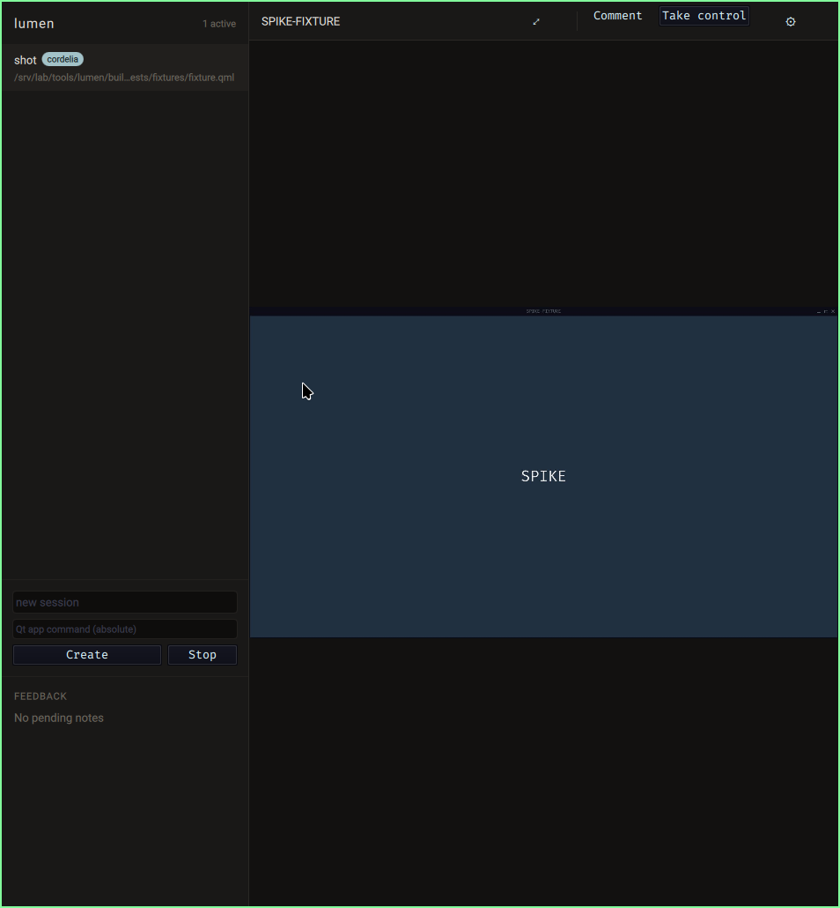

# Lumen

<p align="center">
  
</p>

Lumen hosts Qt applications for agents and gives the human a live, controllable
view of the same session. It **is** the compositor: every session is a nested
Wayland client of Lumen, so its surface and its input belong to Lumen directly.
There is no screen capture, no input injection and no network surface — an agent
reaches Lumen over a unix socket in the user's runtime directory.

## How it fits together

- **Daemon** — `lumen-daemon` owns the compositor, every session, the
  accessibility walk, the feedback store and the agent socket. It runs with no
  window and is a systemd user service, so sessions keep running when the viewer
  is closed.
- **Viewer** — `lumen` renders the active session's frames and forwards human
  input. It owns no sessions; closing it ends nothing but the view.
- **Agent CLI** — `lumen-cli` speaks JSON lines to the daemon's socket:
  `ensure`, `status`, `stop`, `click`, `type`, `accessibility`, `feedback`,
  `ack`.
- **Input** — the human's click and an agent's click travel the *same* route:
  the daemon's seat. They cannot diverge.
- **Feedback** — humans drag a rectangle over the frame and type a note; it lands
  in SQLite with the annotated pixels and the agent picks it up with one command.

## Install

You need Linux with a Wayland session, Qt 6 (base, declarative and the Wayland
compositor modules), a C++ compiler and CMake. Nothing is containerised and
nothing listens on the network.

```bash
git clone http://vigilance:3002/blackopsrepl/lumen.git
cd lumen
make install
```

`make install` builds the three binaries, installs them to `~/.local/bin`,
installs the `lumen.service` systemd **user** unit and starts it. The daemon
comes up enabled, so it starts with your login and survives a logout.

```bash
systemctl --user status lumen.service   # or: make service
lumen-cli status                        # sessions, live
```

The viewer shows the daemon's state in **Settings**, behind the gear in the
toolbar: start, stop, and enable-at-login are all there.

## Run a Qt application

A session is one Qt application plus its own private D-Bus and AT-SPI registry,
hosted by Lumen's compositor. The command is an absolute program plus arguments:

```bash
lumen-cli ensure gitnaga "/opt/gitnaga/bin/gitnaga" --owner desktop-agent
```

The application publishes its controls on its private accessibility bus, so an
agent reads a structured tree instead of guessing from pixels:

```bash
lumen-cli accessibility gitnaga
lumen-cli click gitnaga 240 160
lumen-cli type  gitnaga "hello"
```

### Hosting Lumen inside Lumen

The viewer is itself a Qt application, so it can be hosted as a session of its
own daemon — a useful end-to-end exercise:

```bash
lumen-cli ensure lumen-self "$(command -v lumen)" --owner you
```

The nested viewer finds the daemon because the daemon publishes its own socket
paths in the environment; a client inside a session cannot derive them from its
private `XDG_RUNTIME_DIR`.

## Watch and steer as a human

Every session is listed on the left. The canvas shows the active session's live
frame. **Take control** forwards your mouse and typing into the session;
**Escape** hands control back to the agent.



To leave feedback, click **Comment** and drag a rectangle over the area. Lumen
crops those pixels out of the frame at the moment you send the note, so it still
shows what you meant after the session redraws. The agent reads the note on its
next `lumen-cli feedback` call.

## Operate

| make target | what it does |
| --- | --- |
| `make build` | configure and build every target |
| `make test` | the unit and integration suite |
| `make install` | install the binaries and the daemon service |
| `make service` | daemon service state |
| `make logs` | follow the daemon's logs |
| `make clean` | remove the build tree |

Session profiles are ephemeral. Each session gets a private directory under
`<data_dir>/run`, created mode `0700` and removed when the session ends — on
stop, on a crash, and at the next start. The feedback database at
`<data_dir>/feedback.db` persists.

Upgrading:

```bash
git pull
make install     # stops the running daemon, replaces the binaries, restarts it
```

## Security

There is no network surface at all. The daemon listens on two unix sockets in
the user's runtime directory: one for agents, one for the viewer's frame stream.

A session's command is an absolute executable plus arguments. Lumen validates
that the program is absolute, exists and is executable — which keeps a typo from
starting something unintended — but the program runs with the daemon's
privileges. Lumen is not a sandbox for what a session does.

## Layout

```
src/compositor.*       the Wayland compositor: output, seat, one view per session
src/session*           one session: process, private bus, AT-SPI registry
src/agentserver.*      the agent socket (JSON lines)
src/framestream.*      the viewer's frame socket (length-prefixed JPEG)
src/accessibility.*    the AT-SPI tree walk
src/feedbackstore.*    the SQLite note store
src/daemon/            the daemon entry point
src/viewer/            the viewer: client, controls, frame provider, palette
src/cli/               the agent CLI
qml/                   the viewer's QML
packaging/lumen.service the systemd user unit
bin/install.sh         install and restart
tests/                 unit, integration and frame-render tests
```

## License

Lumen is free software under the GNU General Public License, version 3 or (at
your option) any later version. See [`LICENSE`](LICENSE) for the full text.
